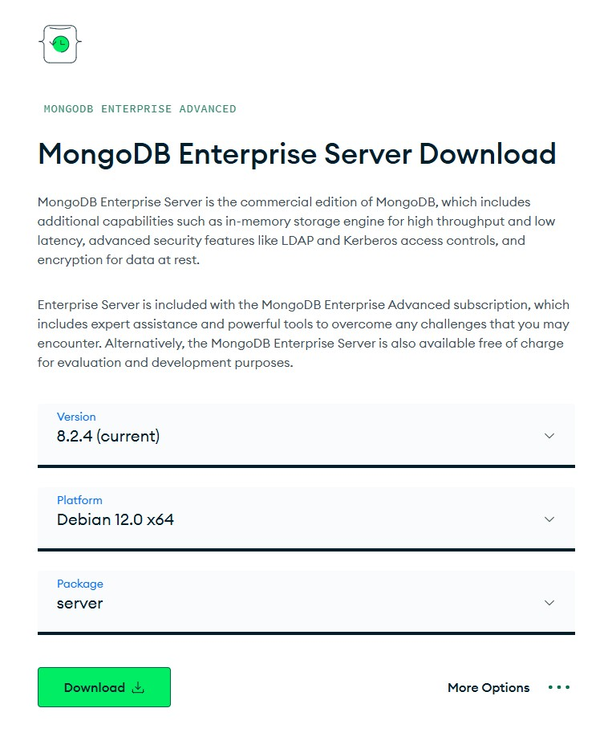

# MongoDB Encryption Demos (CSFLE & Queryable Encryption)

Minimal, copy/pasteable Node.js examples that write and read encrypted data with MongoDB 8.2+ (Queryable Encryption tested against 8.2.4 server). These samples are for learning and demos only, do not reuse the local keys or settings in production.

## What lives in `src/`
- `demo.fle-v1.csfle.manual.js`: FLE v1 manual encryption using `ClientEncryption` for explicit encrypt/decrypt before insert/query.
- `demo.fle-v1.csfle.auto.js`: FLE v1 auto-encryption with a schema map; uses `mongocryptd` (or `crypt_shared`) to transparently encrypt/decrypt client-side.
- `demo.fle-v2.qe.simple.js`: Smallest Queryable Encryption example that creates an encrypted collection with equality on `ssn`.
- `demo.fle-v2.qe.class.js`: Same QE flow but wrapped in the `FLEv2` helper class for reuse.
- `src/lib/FLEv1.js` and `src/lib/FLEv2.js`: Lightweight helpers to initialize key vaults, data keys, and encrypted clients.

## Prerequisites
- Node.js LTS (18+). Install from https://nodejs.org/en/download.
- MongoDB Enterprise/Atlas server 8.2+ reachable from your machine. QE was validated with 8.0.4.
- Crypto service:
  - `mongocryptd` on PATH for CSFLE auto-encryption.
  - `mongo_crypt_v1` shared library available; set `MONGODB_CRYPT_SHARED_LIB_PATH` to its absolute path for QE and for CSFLE without `mongocryptd`.

## Quick crypt_shared setup (QE / auto-encryption)

Create a project
```bash
 mkdir myproj && cd myproj
```

Install MongoDB Crypt (Service or Shared Library)
- MacOS (pick the right hardware build)
  ```bash
  curl -L https://downloads.mongodb.com/osx/mongo_crypt_shared_v1-macos-arm64-enterprise-8.0.4.tgz | tar xzvf - lib/mongo_crypt_v1.dylib
  ```
- Windows x64 EA installer
  ```bash
  # Download https://downloads.mongodb.com/windows/mongodb-windows-x86_64-enterprise-8.2.4-signed.msi
  powershell -Command "Invoke-WebRequest -Uri 'https://downloads.mongodb.com/windows/mongodb-windows-x86_64-enterprise-8.2.4-signed.msi' -OutFile 'C:\Users\demo\Downloads\mongodb-enterprise.msi'"
  # Install mongodb-windows-x86_64-enterprise-8.2.4-signed.msi
  set MONGODB_CRYPT_SHARED_LIB_PATH='C:\Program Files\MongoDB\Server\8.2\bin\mongo_crypt_v1.dll'
  ```

- Windows x86_64 shared library
  ```bash
  # Download https://downloads.mongodb.com/windows/mongo_crypt_shared_v1-windows-x86_64-enterprise-8.2.4.zip
  powershell -Command "Invoke-WebRequest -Uri 'https://downloads.mongodb.com/windows/mongo_crypt_shared_v1-windows-x86_64-enterprise-8.2.4.zip' -OutFile 'C:\Users\demo\Downloads\mongo_crypt_shared_v1-windows-x86_64-enterprise-8.2.4.zip'"
  tar -xf mongo_crypt_shared_v1-windows-x86_64-enterprise-8.2.4.zip 'C:\Program Files\MongoDB\crypt_shared\8.2.4'
  set MONGODB_CRYPT_SHARED_LIB_PATH='C:\Program Files\MongoDB\crypt_shared\8.2.4\bin\mongo_crypt_v1.dll'
  ```
- Linux (AWS / Debian / Ubuntu)
  ```bash
  # Use https://www.mongodb.com/download-center/enterprise/releases and pick the correct CPU (ARM vs x86) and the stand-alone crypt_shared package.

  xattr -d com.apple.quarantine ./lib/mongo_crypt_v1.dylib  # remove quarantine on macOS; -d deletes the attribute
  export MONGODB_CRYPT_SHARED_LIB_PATH="$PWD/lib/mongo_crypt_v1.dylib" # absolute path required
  ```
  

```bash
npm init -y                                          # -y accepts defaults to create package.json
npm install mongodb mongodb-client-encryption        # drivers + client-side encryption addon
```

## Configuration (.env)
Set the variables you need (defaults used by the demos shown in parentheses):
- `MONGODB_URI` (`mongodb://localhost:27017`): where the server lives.
- `MASTER_KEY_PATH` (`cfg/master-key.bin`): local KMS master key; auto-created if missing.
- `KEYVAULT_DATABASE` / `KEYVAULT_COLLECTION` (`encryption` / `keyVault`): where data keys are stored.
- `MONGODB_DATABASE` / `MONGODB_COLLECTION` (`demo` / `customers_csfle`): data namespace used by demos.
- `MONGODB_CRYPT_SHARED_LIB_PATH`: absolute path to `mongo_crypt_v1` (required for QE and optional for CSFLE auto).
- `DATA_KEY_ALT_NAME` (`demo-data-key`): alternate name used to look up/create the data key.

Security note: the repository uses a local KMS provider for simplicity. In production, replace it with a real KMS (AWS KMS, Azure, GCP, or KMIP) and manage keys securely.

## Install & run the demos (this repo)
```bash
npm install                     # install dependencies
npm run demo:cs:manual          # CSFLE v1 manual encrypt/decrypt with ClientEncryption
npm run demo:cs:auto            # CSFLE v1 auto-encryption using schema map + mongocryptd/crypt_shared
npm run demo:qe:simple          # QE v2 minimal equality demo that creates the encrypted collection
npm run demo:qe:class           # QE v2 using the FLEv2 helper class for reuse/testability
npm test                        # integration tests (requires MongoDB, key vault, and crypt_shared/mongocryptd)
```
Each npm script uses the `.env` values above. QE runs need `MONGODB_CRYPT_SHARED_LIB_PATH` set; CSFLE auto either needs `mongocryptd` on PATH or the same crypt_shared library.

## What each demo does (developer + security view)
- CSFLE manual (`demo.fle-v1.csfle.manual.js`): explicitly encrypts `ssn` (deterministic) and `email` (randomized) before `insertOne`, then decrypts on read. Good for understanding per-field control and the cost of handling ciphertext yourself.
- CSFLE auto (`demo.fle-v1.csfle.auto.js`): uses a schema map so reads/writes happen on plaintext while the driver encrypts/decrypts transparently. Shows how `mongocryptd`/`crypt_shared` participates; safer for apps that want minimal code changes.
- QE simple (`demo.fle-v2.qe.simple.js`): smallest possible QE flow—creates the encrypted collection with equality support on `ssn`, inserts, and queries by `ssn`. Shows the `ClientEncryption.createEncryptedCollection` API.
- QE class-based (`demo.fle-v2.qe.class.js`): wraps QE initialization in `FLEv2`, reusing schema and key vault namespaces and ensuring the encrypted collection exists. Easier to integrate into real apps with multiple call sites.

## OpenSSL helpers (what each option means)
- 96-byte hex key for local KMS:
  ```bash
  # rand = secure RNG, -hex = hex output, 96 = 96 bytes, > writes to file
  openssl rand -hex 96 > hex96_key.txt
  ```
- RSA 2048 key pair:
  ```bash
  # genpkey chooses RSA, writes private key, 2048-bit size
  openssl genpkey -algorithm RSA -out private_key.pem -pkeyopt rsa_keygen_bits:2048
  # extracts the public key
  openssl rsa -pubout -in private_key.pem -out public_key.pem
  ```
- 32-byte AES key (Base64):
  ```bash
  # -base64 encodes the 32 random bytes
  openssl rand -base64 32 > aes_key.txt
  ```
- SHA-256 helper:
  ```bash
  # -n avoids newline, dgst -sha256 hashes the input
  echo -n "TextoSeguroParaClave" | openssl dgst -sha256
  ```
- Local master key (binary):
  ```bash
  # -out writes raw bytes; 96 bytes is what the driver expects for local KMS
  openssl rand -out master-key.bin 96
  ```

## Quick, copy/paste QE starter (8.0.4 server)
Not for production; set `MONGODB_CRYPT_SHARED_LIB_PATH` first.
```javascript
import { MongoClient, ClientEncryption } from "mongodb";
import dotenv from "dotenv";
dotenv.config({ override: true });

const {
  MONGODB_URI = "mongodb://localhost:27017",
  MONGODB_DATABASE = "demo",
  MONGODB_COLLECTION = "customers_csfle",
  MONGODB_CRYPT_SHARED_LIB_PATH,
} = process.env;

const keyVaultNamespace = "encryption.keyVault";
const kmsProviders = { local: { key: /* read your master key Buffer here */ } };
const encryptedFields = { encryptedFields: { fields: [{ path: "ssn", bsonType: "string", queries: { queryType: "equality" } }] } };
const encryptionOpts = { keyVaultNamespace, kmsProviders, extraOptions: { cryptSharedLibPath: MONGODB_CRYPT_SHARED_LIB_PATH } };

const client = new MongoClient(MONGODB_URI, { autoEncryption: encryptionOpts });
await client.connect();
const clientEncryption = new ClientEncryption(client, encryptionOpts);
await clientEncryption.createEncryptedCollection(client.db(MONGODB_DATABASE), MONGODB_COLLECTION, { provider: "local", createCollectionOptions: encryptedFields });
const coll = client.db(MONGODB_DATABASE).collection(MONGODB_COLLECTION);
await coll.insertOne({ name: "Alice", ssn: "123-45-6789" });
console.log(await coll.findOne({ ssn: "123-45-6789" }));
```

## References
- [In-Use Encryption](https://www.mongodb.com/docs/manual/core/security-in-use-encryption/)
  - [Client-Side Field Level Encryption](https://www.mongodb.com/docs/manual/core/csfle/#std-label-manual-csfle-feature)
    - [Client encrypt method](https://www.mongodb.com/docs/manual/reference/method/ClientEncryption.encrypt/)
    - [Supported Query Operators](https://www.mongodb.com/docs/manual/core/csfle/reference/supported-operations/#std-label-csfle-supported-query-operators)
  - [Queryable Encryption](https://www.mongodb.com/docs/manual/core/queryable-encryption/)
    - [Supported Operations for Queryable Encryption](https://www.mongodb.com/docs/manual/core/queryable-encryption/reference/supported-operations/)
    - [Queryable Encryption quick-start](https://www.mongodb.com/docs/manual/core/queryable-encryption/quick-start/)
    - [Queryable Encryption Dependencies](https://www.mongodb.com/docs/manual/core/queryable-encryption/install/?language-no-dependencies=nodejs&operating-system=windows)
- Downloads
  - [MongoDB Enterprise Server Download](https://www.mongodb.com/try/download/enterprise)
  - [MongoDB Docker Image Download](https://hub.docker.com/_/mongo)
- Tools
  - [Manage MongoDB Atlas Database Secrets in HashiCorp Vault](https://www.mongodb.com/company/blog/technical/manage-atlas-database-secrets-hashicorp-vault)
  - [Docker and MongoDB](https://www.mongodb.com/resources/products/compatibilities/docker)
- [Cost Optimization with Optimal Document Size](https://www.mongodb.com/company/blog/technical/cost-optimization-with-optimal-document-size)