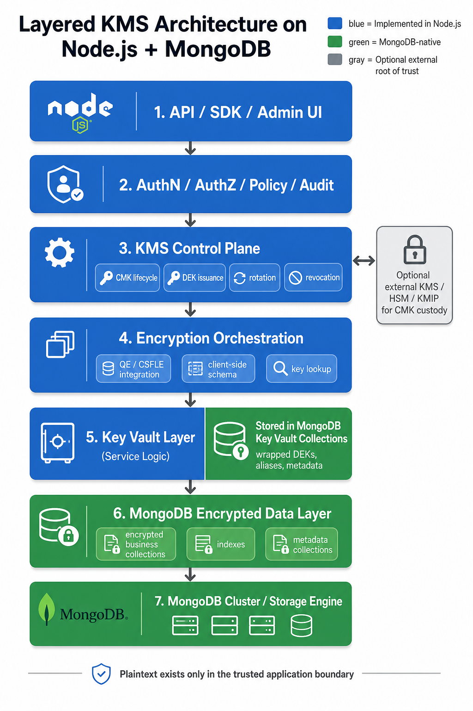

# Implementing a Custom KMS on MongoDB with Node.js

## Introduction

A custom key management service can be built on top of MongoDB, but it must be described precisely. MongoDB can act as the persistence layer for encrypted key records, metadata, policy state, audit data, and encrypted application data, while a Node.js application implements the KMS control plane and encryption orchestration. Queryable Encryption and Client-Side Field Level Encryption are not themselves a KMS. They are client-side encryption mechanisms that consume keys and use MongoDB as the storage system for encrypted fields and key-vault documents.

The strongest version of this design uses MongoDB for the Key Vault and encrypted data plane, Node.js for policy and lifecycle control, and an external KMS, KMIP provider, or HSM-backed system for Customer Master Key custody. MongoDB recommends storing the CMK in a remote KMS because the CMK is the most sensitive key in the hierarchy, and compromise of the CMK compromises all protected data.

This article describes an implementable architecture that stays within documented MongoDB capabilities, avoids unsupported combinations, and follows the security assumptions published for QE and CSFLE.

## What this solution is, and what it is not

This solution is a Node.js security platform that provides key lifecycle APIs, policy enforcement, tenant and workload segregation, audit trails, DEK creation and lookup, and integration with MongoDB client-side encryption features.

This solution is not a hardware-backed KMS by default. If the same Node.js runtime stores or directly handles the CMK locally, the result is a custom key management application, but not a root-of-trust equivalent to AWS KMS, Azure Key Vault, Google Cloud KMS, or an HSM-backed KMIP service. MongoDB recommends remote KMS custody for CMKs and treats local key handling as something to use with great caution in production.

## Core design principles

### 1. Keep the CMK outside the main trust boundary

MongoDB’s model uses envelope encryption: the CMK encrypts DEKs, and DEKs encrypt document fields. MongoDB stores wrapped DEKs in the Key Vault collection, but MongoDB cannot decrypt them because key management is client-side and customer controlled.

The safest design is therefore:

- CMK in external KMS, KMIP, or HSM-backed service.
- Wrapped DEKs in MongoDB Key Vault collections.
- Application data encrypted with DEKs through QE or CSFLE.

### 2. Treat Node.js as the control plane

The Node.js layer should own the administrative behaviors that MongoDB does not implement as a product KMS, such as creating and registering keys, mapping keys to tenants and workloads, approving or denying key use, rotating and revoking keys, orchestrating rewrap operations, and emitting audit events.

### 3. Use MongoDB as the data plane and key-vault persistence layer

MongoDB is well suited for storing Key Vault documents, aliases and metadata, audit records, encrypted business data, and metadata collections used by QE.

### 4. Enforce encryption logic from the client side

Both QE and CSFLE encrypt data in the application before it is sent to MongoDB. MongoDB only stores encrypted values for protected fields, and decryption happens client-side for applications that have access to the relevant keys.

### 5. Pin schema rules client-side

MongoDB warns that if the application relies on server-side schema only, a compromised server can alter the schema and cause the client to send plaintext for fields that should have been encrypted. The documented mitigation is to use client-side schema validation.

## The layered architecture

## Layer 1. External root of trust

This is the top security layer and should hold the CMK whenever possible. Supported KMS provider patterns for MongoDB in-use encryption include AWS KMS, Azure Key Vault, Google Cloud KMS, KMIP, and local providers. MongoDB recommends the remote KMS options for production-grade custody of the CMK.

What this layer should do:

- generate or securely import the CMK.
- protect the CMK from direct application exposure where possible.
- perform or authorize wrap and unwrap operations.
- provide key versioning and rotation semantics.

What this layer should not do:

- store DEK metadata as the system of record for application routing.
- store business-level policy objects.
- replace the Node.js control plane for workflow and tenant policy.

If an external KMS is unavailable, MongoDB supports local key providers, but the documentation explicitly recommends caution and advises against ordinary filesystem storage for production designs.

## Layer 2. Node.js KMS control plane

This is the main application layer and is where the custom KMS behavior lives. The MongoDB Node.js driver is the official integration point for JavaScript and TypeScript applications, and the `mongodb-client-encryption` package provides the client-side encryption functionality needed by the service.

Typical responsibilities for this layer:

1. Identity and access control
   - authenticate callers.
   - authorize operations by tenant, service, environment, and key purpose.
   - enforce least privilege for read, issue, rotate, and revoke operations.

2. Key lifecycle management
   - create new DEKs.
   - assign aliases and ownership metadata.
   - disable, retire, or revoke keys.
   - trigger rewrap workflows when the CMK changes.

3. Policy engine
   - define whether a workload uses QE or CSFLE.
   - define whether a field may be searchable.
   - map a data domain to a key strategy.

4. Audit and observability
   - record every key-management event.
   - record every administrative change.
   - correlate application actions to operator identity.

This layer is what makes the system a KMS-like service rather than just a key store.

## Layer 3. Encryption orchestration in Node.js

This layer binds the business application to MongoDB’s encryption mechanisms.

The Node.js driver supports in-use encryption, and the driver ecosystem exposes both the general driver and the client-encryption package. MongoDB supports both QE and CSFLE, and both can be used with automatic or explicit encryption modes, depending on the deployment and application design.

This layer should do the following:

- create `ClientEncryption` instances for key management operations.
- create DEKs through the driver encryption API.
- resolve the correct key or alias for each protected field set.
- load and pin client-side schema.
- decide whether a collection uses QE or CSFLE.
- route reads and writes through the correct encrypted client configuration.

A practical rule is:

- use QE when encrypted equality or range queries are needed and its metadata and supported-operation model fit the workload.
- use CSFLE when more flexibility is needed, especially different keys for the same field, such as key-per-tenant or key-per-user designs.

## Layer 4. MongoDB Key Vault layer

The Key Vault layer is implemented partly in Node.js and partly in MongoDB.

On the MongoDB side, the Key Vault collection stores wrapped DEKs as BSON documents. The collection must have a unique index on `keyAltNames`, should live in a non-admin namespace, and can be hosted either on the same MongoDB deployment as the encrypted data or on a different deployment if the application can reach both.

A sensible collection design is:

- database: `encryption`.
- collection: `__keyVault`.
- additional application-owned collections for policy state and audit.

This layer should store:

- wrapped DEKs.
- aliases.
- tenant and domain metadata.
- status flags such as active, disabled, retired.
- rotation generation or version fields.
- creation and update timestamps.

This layer should not store plaintext DEKs or plaintext CMKs. MongoDB stores DEKs encrypted with the CMK, and MongoDB cannot decrypt them itself.

## Layer 5. MongoDB encrypted data layer

This is where encrypted business data lives. The application writes encrypted fields into normal business collections, while MongoDB stores the ciphertext, indexes, and metadata collections required by QE where applicable.

There are two main patterns here.

### Pattern A. QE-based collections

Use QE when:

- the workload is a new design.
- equality or range queries are needed on encrypted fields.
- the supported-operation subset and metadata model are acceptable.

Important constraints:

- QE equality and range queries are supported in production, but prefix, suffix, and substring queries remain preview and should not be used in production designs.
- QE and CSFLE cannot be used in the same collection.
- adding new encrypted fields can require rebuilding metadata collections and indexes.

### Pattern B. CSFLE-based collections

Use CSFLE when:

- the workload needs deterministic equality on selected fields.
- different keys are needed for the same field across users or tenants.
- more schema flexibility is needed.
- an existing application is being encrypted incrementally.

Important constraints:

- with CSFLE, only deterministically encrypted fields are queryable for equality.
- automatic encryption does not support fields inside arrays of documents.
- some expressions and views can behave unexpectedly if they operate on encrypted BinData rather than decrypted values.

## Layer 6. Operational and governance layer

A real KMS-like service needs a governance plane, even if MongoDB is only the storage and encryption substrate.

This layer should include:

- audit event storage.
- operator approval paths for rotation or revocation.
- backup and disaster recovery plans for key metadata.
- change control for schemas and field-encryption maps.
- monitoring that does not assume full server-side visibility into encrypted workloads.

This matters because QE intentionally redacts some diagnostics and omits some operations from normal query logging, which means support and performance tooling see less than they would for plaintext collections.

## A realistic implementation path in Node.js

A minimal but real implementation would look like this.

### Step 1. Build the service skeleton

Use the official MongoDB Node.js driver and add `mongodb-client-encryption` for encryption support. MongoDB documents this package as the encryption library for Node.js applications.

Ensure that the Node.js driver, `mongodb-client-encryption`, the MongoDB server version, and the Node.js runtime are a supported combination. MongoDB’s driver guidance says the major version of `mongodb-client-encryption` must match the major version of the Node.js driver.

### Step 2. Create separate clients for control and data paths

Use one MongoDB client for ordinary application data operations and one client for key-management tasks if that separation helps enforce responsibility boundaries. MongoDB’s driver tutorials use `ClientEncryption` for data key creation and separate encrypted client configuration for application operations.

### Step 3. Create the Key Vault namespace and indexes

Create the Key Vault collection in a non-admin namespace, usually `encryption.__keyVault`, and ensure the unique index on `keyAltNames` exists before performing DEK management.

### Step 4. Create or register the CMK binding

Bind the Node.js service to the chosen KMS provider configuration. If a cloud KMS or KMIP provider is used, the CMK remains in that provider. If a local provider is used, keep the CMK outside ordinary filesystem exposure and treat that design as weaker than remote KMS custody.

### Step 5. Create DEKs through the driver encryption API

Use the driver’s key-management functions to create DEKs, assign aliases, and store the wrapped DEK records in the Key Vault collection.

### Step 6. Pin client-side schemas

Define which fields are encrypted, how they are queried, and which key identifiers apply, and load those rules client-side. Do not rely only on server-side schema for field protection decisions.

### Step 7. Encrypt business collections with QE or CSFLE

Choose one mechanism per collection. Use QE for searchable encrypted fields when the query model fits. Use CSFLE where per-field key flexibility or deterministic equality behavior is the primary need.

### Step 8. Add rotation workflows

When the CMK rotates, do not assume old DEKs are automatically rewrapped. MongoDB documents `rewrapManyDataKey()` for rewrapping existing DEKs under a new CMK without changing the DEKs themselves.

## Security model and trust boundaries

The main security guarantee of this architecture is that protected application data is encrypted before MongoDB stores it, and decryption happens only in applications that have access to the relevant keys.

The main non-guarantees are equally important.

MongoDB explicitly states that QE and CSFLE do not protect against:

- adversaries that obtain the CMK and DEKs.
- adversaries with arbitrary write access to collections containing encrypted data.

Queryable Encryption also does not claim protection against attackers who obtain both database snapshots and accompanying query transcripts or logs, especially for range queries.

This means the real trust boundaries are:

1. the CMK custody system.
2. the Node.js application runtime.
3. the schema definition and deployment pipeline.
4. the audit and logging systems.
5. the write path into encrypted collections.

## Recommended security posture

For a production implementation, the architecture should adopt the following posture.

### Recommended

- external KMS, KMIP, or HSM-backed CMK custody.
- client-side schema enforcement.
- least-privilege access to both MongoDB and the external KMS.
- separate operator roles for key administration and application administration.
- rotation procedures using DEK rewrap, not ad hoc key replacement.
- explicit treatment of logs, traces, query transcripts, and backups as sensitive assets.

### Avoid

- storing CMKs in ordinary local files in production.
- mixing QE and CSFLE in the same collection.
- trusting server-side schema alone.
- assuming encrypted collections support all normal query or aggregation behavior.
- deleting CMKs or DEKs without a recovery and retention policy, because doing so can make data permanently unreadable.

## Minimal issues list and how to handle them

### 1. CMK stored too close to the application

Issue: if the Node.js service holds the CMK locally, the trust boundary collapses and compromise of the service can expose the root key.

Mitigation: move CMK custody to remote KMS, KMIP, or HSM-backed infrastructure.

### 2. Schema tampering risk

Issue: if the application trusts server-side schema alone, a compromised server can cause fields to be sent in plaintext.

Mitigation: pin schema rules in the client and manage schema changes through the application deployment process.

### 3. Wrong mechanism selected for the data model

Issue: QE is not ideal when different keys are needed for the same field across tenants or users.

Mitigation: use CSFLE for those collections, or partition tenants into separate collections where the keying model becomes simpler.

### 4. Unsupported operations on encrypted fields

Issue: encrypted collections do not behave like plaintext collections for every operation, and some CSFLE operations can return unexpected results when comparing raw BinData.

Mitigation: design read and write paths around the documented supported-operation model and test encrypted workloads explicitly.

### 5. Operational visibility is reduced

Issue: QE redacts some diagnostic signals and omits some operations from the query log, which reduces server-side troubleshooting visibility.

Mitigation: add application-side telemetry, request correlation, and external monitoring around the Node.js service.

### 6. Accidental key destruction

Issue: deleting a DEK or the CMK can render data permanently unreadable.

Mitigation: require approval workflows, backups of key metadata, and clearly defined retirement windows before destructive actions.

## Conclusion

A custom KMS on MongoDB is feasible if it is framed correctly. MongoDB should be used as the encrypted data plane and key-vault persistence layer, while Node.js implements the KMS control plane, policy layer, and encryption orchestration. QE and CSFLE are powerful building blocks for field protection, but they do not replace the need for disciplined CMK custody, client-side schema enforcement, and explicit trust-boundary design.

The cleanest architecture is therefore:

- external system for CMK custody.
- Node.js service for KMS behavior.
- MongoDB Key Vault collections for wrapped DEKs and metadata.
- MongoDB business collections for encrypted application data.

That model is implementable today with public, documented MongoDB capabilities and aligns with the published security assumptions for QE and CSFLE.

## Public references

- MongoDB Queryable Encryption overview: [mongodb.com/docs/manual/core/queryable-encryption](https://www.mongodb.com/docs/manual/core/queryable-encryption/)
- MongoDB Encryption Keys and Key Vaults: [mongodb.com/docs/manual/core/queryable-encryption/fundamentals/keys-key-vaults](https://www.mongodb.com/docs/manual/core/queryable-encryption/fundamentals/keys-key-vaults/)
- MongoDB KMS Providers: [mongodb.com/docs/manual/core/queryable-encryption/fundamentals/kms-providers](https://www.mongodb.com/docs/manual/core/queryable-encryption/fundamentals/kms-providers/)
- MongoDB Choosing an In-Use Encryption Approach: [mongodb.com/docs/manual/core/queryable-encryption/about-qe-csfle](https://www.mongodb.com/docs/manual/core/queryable-encryption/about-qe-csfle/)
- MongoDB Queryable Encryption limitations: [mongodb.com/docs/manual/core/queryable-encryption/reference/limitations](https://www.mongodb.com/docs/manual/core/queryable-encryption/reference/limitations/)
- MongoDB CSFLE overview: [mongodb.com/docs/manual/core/csfle](https://www.mongodb.com/docs/manual/core/csfle/)
- MongoDB CSFLE limitations: [mongodb.com/docs/manual/core/csfle/reference/limitations](https://www.mongodb.com/docs/manual/core/csfle/reference/limitations/)
- MongoDB Node.js driver: [mongodb.com/docs/drivers/node/current](https://www.mongodb.com/docs/drivers/node/current/)
- MongoDB Node.js driver release notes: [mongodb.com/docs/drivers/node/current/reference/release-notes](https://www.mongodb.com/docs/drivers/node/current/reference/release-notes/)
- MongoDB Node.js driver upgrade guidance: [mongodb.com/docs/drivers/node/current/reference/upgrade](https://www.mongodb.com/docs/drivers/node/current/reference/upgrade/)
- MongoDB Queryable Encryption quick start: [mongodb.com/docs/manual/core/queryable-encryption/quick-start](https://www.mongodb.com/docs/manual/core/queryable-encryption/quick-start/)
- MongoDB Mongoose Queryable Encryption tutorial: [mongodb.com/docs/drivers/node/current/integrations/mongoose/mongoose-qe](https://www.mongodb.com/docs/drivers/node/current/integrations/mongoose/mongoose-qe/)

---

## Sources

- [Encryption Keys and Key Vaults - Database Manual - MongoDB Docs](https://www.mongodb.com/docs/manual/core/queryable-encryption/fundamentals/keys-key-vaults/)
- [Choosing an In-Use Encryption Approach - Database Manual - MongoDB Docs](https://www.mongodb.com/docs/manual/core/queryable-encryption/about-qe-csfle/)
- [Client-Side Field Level Encryption - Database Manual - MongoDB Docs](https://www.mongodb.com/docs/manual/core/csfle/)
- [KMS Providers - Database Manual - MongoDB Docs](https://www.mongodb.com/docs/manual/core/queryable-encryption/fundamentals/kms-providers/)
- [Queryable Encryption Limitations - Database Manual - MongoDB Docs](https://www.mongodb.com/docs/manual/core/queryable-encryption/reference/limitations/)
- [MongoDB Node.js Driver - Node.js Driver - MongoDB Docs](https://www.mongodb.com/docs/drivers/node/current/)
- [KMS Providers - Database Manual - MongoDB Docs](https://www.mongodb.com/docs/manual/core/queryable-encryption/fundamentals/kms-providers/)
- [Queryable Encryption Quick Start - Database Manual - MongoDB Docs](https://www.mongodb.com/docs/manual/core/queryable-encryption/quick-start/)
- [Queryable Encryption - Database Manual - MongoDB Docs](https://www.mongodb.com/docs/manual/core/queryable-encryption/)
- [Tutorial: Queryable Encryption with Mongoose - Node.js Driver - MongoDB Docs](https://www.mongodb.com/docs/drivers/node/current/integrations/mongoose/mongoose-qe/)
- [Queryable Encryption Quick Start - Database Manual - MongoDB Docs](https://www.mongodb.com/docs/manual/core/queryable-encryption/quick-start/)
- [Queryable Encryption Limitations - Database Manual - MongoDB Docs](https://www.mongodb.com/docs/manual/core/queryable-encryption/reference/limitations/)
- [CSFLE Limitations - Database Manual - MongoDB Docs](https://www.mongodb.com/docs/manual/core/csfle/reference/limitations/)
- [Upgrade Driver Versions - Node.js Driver - MongoDB Docs](https://www.mongodb.com/docs/drivers/node/current/reference/upgrade/)
- [Queryable Encryption - Database Manual - MongoDB Docs](https://www.mongodb.com/docs/manual/core/queryable-encryption/)
- [Release Notes - Node.js Driver - MongoDB Docs](https://www.mongodb.com/docs/drivers/node/current/reference/release-notes/)
