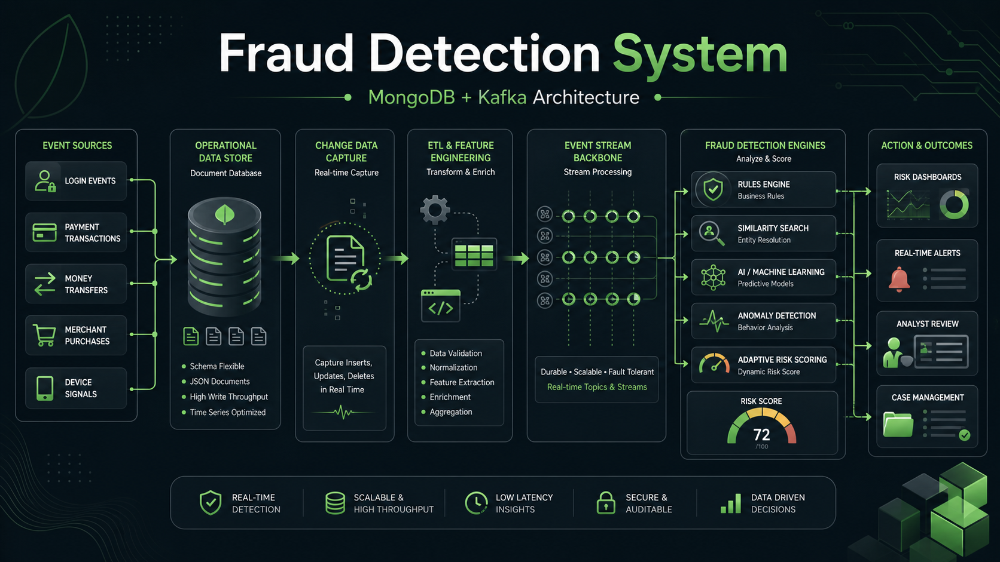
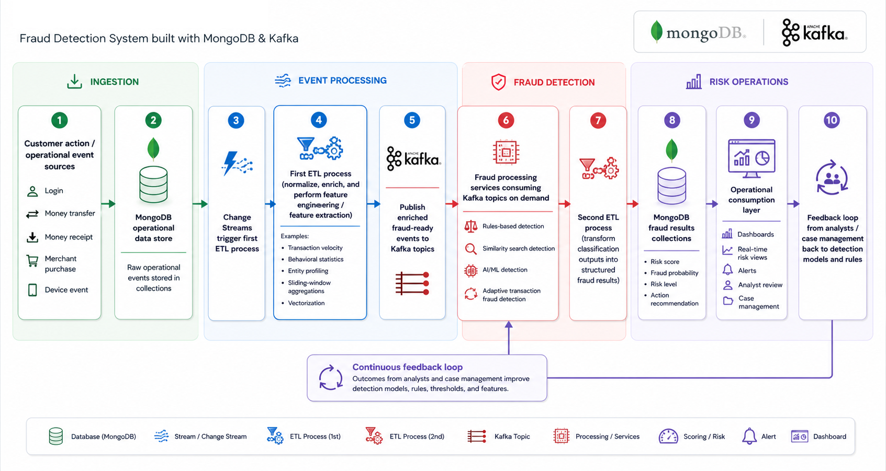

# Fraud Detection System Architecture with MongoDB and Kafka

A modern Fraud Detection System, or FDS, is designed to ingest operational events in real time, enrich them with context, evaluate risk through multiple detection techniques, and produce actionable outputs such as fraud scores, alerts, analyst review items, and operational risk views. Public MongoDB solution documentation describes this type of system as event-driven, real-time, and capable of combining rules, analytics, and AI/ML techniques in a single operational architecture.

In the proposed architecture, MongoDB acts as the operational data store where core business events are stored, such as logins, money transfers, money receipts, merchant purchases, and other customer or device activities. From there, MongoDB Change Streams can detect changes in near real time and publish them to Kafka, where downstream fraud services can process the events asynchronously and at scale. MongoDB can also persist the scored and classified outcomes back into collections for operational use, alerting, dashboards, and case management.
## What a Fraud Detection System is trying to achieve

At a business level, an FDS aims to identify unauthorized or deceptive activity before money is lost, customer trust is damaged, or compliance obligations are breached. In practice, that means recognizing suspicious transaction patterns, anomalous login behavior, device misuse, account takeover signals, identity abuse, and other behaviors that indicate fraud risk. Modern systems also need to operate with low latency, because many decisions must be made while the customer is still waiting for an authorization or system response.
## Core concepts, elements, and components
### 1. Event sources

The first building block is the set of operational systems that generate fraud-relevant events. These usually include authentication flows, payment requests, money transfers, merchant purchases, channel activity, customer profile updates, device telemetry, and reference data. Public MongoDB fraud solution material emphasizes collecting events from operational applications, external sources, and historical datasets to create a unified real-time view of risk.
### 2. Operational data store

MongoDB is a strong fit as the Operational Data Store, or ODS, because it can hold event-centric, semi-structured, and fast-changing operational data in a single platform. In MongoDB public fraud solution documentation, Atlas is positioned as the ODS for real-time card transactions and as the platform for real-time processing and in-app analytics.
### 3. Change capture and event propagation

Once operational events are stored in MongoDB, Change Streams can capture inserts, updates, and deletes in real time. In the MongoDB Kafka integration model, the source connector opens a change stream and publishes those change events into Kafka topics. This makes MongoDB an event producer for downstream fraud pipelines without requiring polling or batch extraction.
### 4. Feature engineering and feature extraction

The transformation from raw events into fraud-ready signals is commonly called feature engineering. In fraud systems, this typically includes feature extraction, transformation, aggregation, and computation over current and historical activity. In practical terms, this stage may derive features such as transaction velocity, average spend per customer, device novelty, geolocation mismatch, merchant deviation, session anomalies, peer-group deviation, or entity-link correlations.

This stage can also be described as an online feature pipeline when features must be generated and served with low latency for real-time inference. In more advanced architectures, this step may include vectorization and embedding generation to support similarity-based detection and contextual scoring.
### 5. Kafka as the processing backbone

Kafka provides the event backbone that decouples event production from fraud scoring and downstream consumers. After MongoDB changes are pushed into Kafka, multiple fraud services can consume those topics for different purposes such as rule evaluation, similarity search, model inference, alert generation, or case management integration. This event-driven design improves scalability, supports asynchronous processing, and allows detection services to evolve independently.
### 6. Detection engines

A mature FDS usually combines several detection methods rather than relying on a single model.

- **Rules-based detection** is the first layer. It applies thresholds, transaction limits, frequency checks, blacklists, policy logic, and business controls.
- **Similarity search detection** compares current events or entities against known suspicious patterns, profiles, or alerts. This is especially useful when the system needs to recognize behavior that looks similar to known fraud even if the exact rule has not been defined.
- **AI/ML detection** applies predictive models to classify fraud likelihood based on engineered features and historical patterns.
- **Adaptive transaction fraud detection** is a more advanced pattern in which behavioral models continuously improve by incorporating new signals, new labels, and operational feedback.
- **Additional relevant techniques** include behavioral analytics, anomaly detection, entity profiling, network analysis, and multimodal or vector-based risk approaches.
### 7. Risk scoring and fraud outcomes

The output of these detection engines is not just a binary fraud or not-fraud decision. In practice, the system should generate a structured risk outcome such as a fraud probability, risk score, confidence level, category, explanation fields, and recommended action. Fraud workflows often use outputs such as approve, reject, under review, alert, or escalate to case management.
### 8. Risk views, alerts, and case management

Once a transaction or event has been scored, the result should be stored back in MongoDB in operational collections optimized for downstream usage. These collections can back real-time risk views, device views, customer risk profiles, alert queues, and case-management screens. In a production environment, this stage is also where alerting, user-facing dashboards, analyst queues, and downstream investigation processes are typically connected.
### 9. Feedback loop

A good FDS improves over time. Analysts review alerts, confirm fraud or non-fraud outcomes, and that feedback is sent back into the system to refine rules, profiles, and models. This feedback loop is one of the key mechanisms that allows modern fraud systems to adapt to changing attack patterns and reduce false positives over time.
## A basic end-to-end flow

 

A simple flow for this architecture can be described as follows:

1. A customer action occurs, such as a login, transfer, payment, or merchant purchase, and the operational event is written to MongoDB.
2. MongoDB Change Streams detect the new or updated document and trigger an ETL (Extract, Transform, and Load) process before the event is published to Kafka. In this step, the raw operational event is normalized, enriched, and transformed into a fraud-ready event payload.
3. Feature engineering is part of this ETL step. It derives fraud-relevant signals such as extracted attributes, transformed fields, sliding-window aggregations, behavioral statistics, entity profiling, or vectorization.
4. Once this ETL and feature engineering step is completed, the MongoDB Kafka source connector publishes the enriched event into one or more Kafka topics for downstream fraud processing.
5. Fraud processing services consume the Kafka topics according to available capacity and apply multiple detectors such as rules-based checks, similarity search, AI/ML scoring, and adaptive behavioral detection.
6. The fraud outcome is produced as part of a second ETL process, where the classified event is transformed into a structured fraud result that includes a risk score, fraud probability, risk level, and action recommendation.
7. The result is stored in MongoDB as an operational fraud object, either directly by the scoring service or through the MongoDB Kafka sink connector if the classification result is first published to Kafka.
8. MongoDB collections then support real-time dashboards, customer or device risk views, alerting, analyst review, and case management. Analyst feedback can later be used to refine rules and retrain models.
## Why this architecture is a good fit

This solution maps well to the needs of an FDS because fraud platforms require operational data capture, real-time event propagation, flexible data modeling, low-latency scoring, and continuous feedback. Public MongoDB fraud solution documentation positions Atlas as the ODS, uses event-driven processing for real-time classification, and integrates with AI/ML platforms and operational workflows. Kafka strengthens the design by decoupling ingestion from processing and allowing multiple consumers to classify, correlate, and react to events asynchronously.
## Key points

- **ODS, Operational Data Store**: MongoDB centralizes transactions and operational events such as logins, transfers, payments, and purchases, making it the live source of truth for fraud analysis and downstream actions.
- **EDA, Event-Driven Architecture**: The system is reactive by design. Fraud-relevant events are captured and propagated immediately, which is particularly valuable in microservices environments and complex financial platforms where asynchronous event flows are common.
- **CDC, Change Data Capture**: MongoDB Change Streams detect operational changes, making CDC the trigger point for publishing events to Kafka and launching downstream fraud workflows.
- **Feature Engineering / Feature Extraction**: Before events are scored, the system derives the variables that matter for fraud, such as temporal, behavioral, statistical, and contextual features. This is the standard transformation stage between raw events and model-ready inputs.
- **Online Feature Processing**: Fraud systems often require low-latency online features for immediate decisions. This is the stage where dynamic features are generated and served for real-time scoring.
- **Streaming Materialization / Views**: After events are classified, the scored results are persisted into MongoDB collections optimized for operational consumption, such as risk views, device views, transaction aggregates, alert queues, and analyst dashboards.
- **Multi-method Detection**: The architecture supports rules, similarity search, AI/ML scoring, adaptive behavioral modeling, and feedback loops in combination rather than as mutually exclusive approaches.
- **Case Management and Feedback**: Fraud detection is only useful if outputs lead to action. Alerts, analyst review, and feedback loops are standard parts of the system and help the platform improve continuously.
## Conclusion

A Fraud Detection System built with MongoDB and Kafka is a strong architectural fit when the objective is to capture operational events in real time, convert them into fraud-relevant features, process them with multiple detection methods, and materialize the outcomes back into operational views and action queues. In this design, MongoDB is not only the database of record for operational events but also the platform for risk materialization, alert consumption, and user-facing fraud operations, while Kafka provides the scalable event backbone that connects change capture, feature engineering, and fraud scoring into one coherent system.

---
## Sources

- [Fraud Prevention with MongoDB](https://www.mongodb.com/solutions/industries/financial-services/fraud-prevention)
- [Real-Time Card Fraud Solution Accelerator, MongoDB Docs](https://www.mongodb.com/docs/atlas/architecture/current/solutions-library/card-fraud-solution/)
- [Real-time Card Fraud Solution, MongoDB](https://www.mongodb.com/solutions/solutions-library/real-time-card-fraud-solution)
- [MongoDB Kafka Connector Overview](https://www.mongodb.com/docs/kafka-connector/current/)
- [Change Streams, MongoDB Kafka Source Connector](https://www.mongodb.com/docs/kafka-connector/current/source-connector/fundamentals/change-streams/)
- [MongoDB Kafka Sink Connector](https://www.mongodb.com/docs/kafka-connector/current/sink-connector/)
- [Getting Started with the MongoDB Kafka Sink Connector](https://www.mongodb.com/docs/kafka-connector/current/tutorials/sink-connector/)
- [Anti-Money Laundering and Fraud Prevention With MongoDB Vector Search and OpenAI](https://www.mongodb.com/blog/post/anti-money-laundering-fraud-prevention-mongodb-vector-search-openai)
- [Apache Kafka Documentation](https://kafka.apache.org/documentation/)

